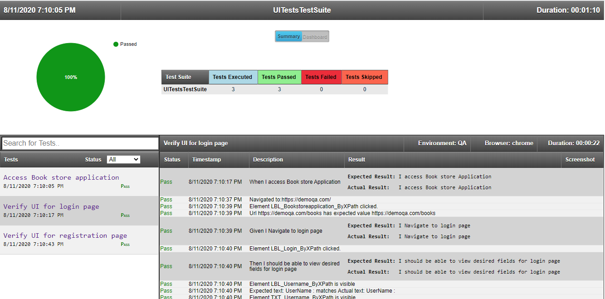
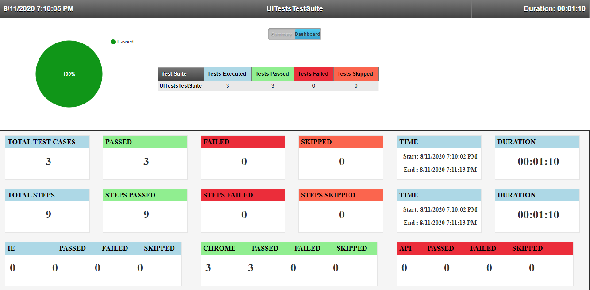
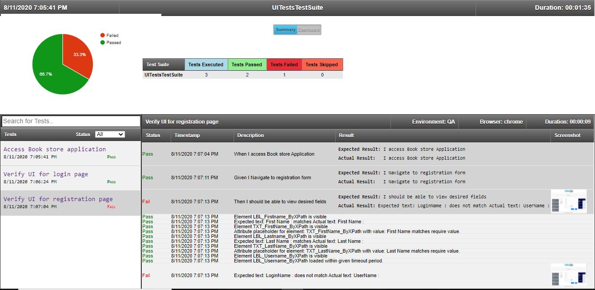

# Selenium-C#-Specflow-UI-Tests
Selenium UI Tests using Selenium, C# and Specflow

### Usage
Install-Package Test.Automation.Framework -Version 1.0.0.5

### Interesting stuff: Scenario execution [HTML Reports](https://github.com/SandeepDhamale19/Selenium-UI-Tests/tree/master/TestAutomation.UITests/Results)
##### A. Test Suites: Summary [All passed]
 <kbd></kbd>
 <!---->
 
##### B. Test Suites: Dashboard
  <kbd><kbd>

##### C. Test Suites: Summary [Failed Scenario]
  <kbd></kbd>

 
